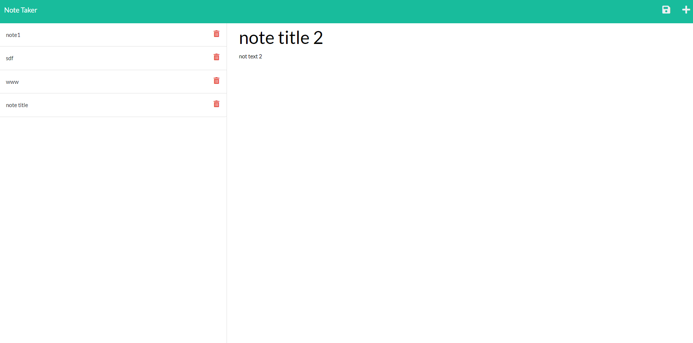

  # MSUBC_Module11_CH Note Taker by Mateusz Zielinski
  ## Description
  This program contains a simple note taking app in which the user can add and remove notes, and have them saved in a database for later
  
  
  ## License
  
  This application is not currently under any license agreement.
  ## Table of Contents
  - [License](#License)
  - [Usage](#Usage)
  - [Installation](#Installation)
  - [Testing](#Testing)
  - [Contributing](#Contributing)
  - [Tutorial](#Tutorial)
  ## Usage
  - open the project in vscode or another compatible editor
  - right click on 'server.js' and select 'open in integrated terminal'
  - in the command line type in 'npm i' then 'npm start' and click on the provided link
  - to add a note, make sure the title and text fields aren't blank and click the save button
  - to delete a note, click on the trashcan next to its title
  - !! alternatively, simply access the live application at https://powerful-harbor-37574.herokuapp.com/ !!
  ## Installation
  - open gitbash
  - navigate to the desired parent folder 
  - type into gitbash 'git clone https://github.com/IMadeThisJustToPostThis/MSUBC_Module11_CH-Note-Taker.git'
  ## Testing
  no tests
  ## Contributing
  contibute however you want i don't care
  ## Questions
  Github:<https://github.com/IMadeThisJustToPostThis>
  
  Email: zielinm2@mail.lcc.edu